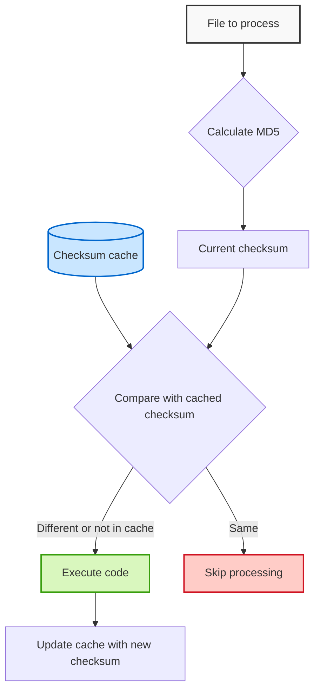

# PyChecksumCache

A lightweight Python library that uses MD5 checksums to track file changes and execute code only when files have been modified. PyChecksumCache maintains a persistent cache of file checksums, making it ideal for build systems, asset processors, incremental compilers, and any tools that need efficient change detection.

## How It Works



## Features

- Track changes to files using MD5 checksums
- Persistent cache storage in JSON format
```bash
{
  "tests/file1.txt": "ff1e0283123d14cf8bd52ac449770017",
  "tests/file2.txt": "b445bf8b5da4cf880dd14e98c18c1bfa"
}
```
- Execute functions only when file content has changed
- Batch transform multiple files with automatic output management
- Full async/await support
- Works with Python 3.10+
- No external dependencies

## Installation

```bash
pip install pychecksumcache
```

Or with uv:

```bash
uv pip install pychecksumcache
```

## Quick Start

### Basic Usage

```python
import pytest
from pychecksumcache import PyChecksumCache
import os

input_files = ["tests/file1.txt", "tests/file2.txt"]
output_folder = "output"
output_extension = ".generated.txt"

@pytest.mark.asyncio
async def test_pychecksumcache_skipped():
    # Define a transformation function
    def transform_func(input_path, output_path):
        with open(input_path, 'r') as infile, open(output_path, 'w') as outfile:
            content = infile.read()
            # Apply some transformation
            transformed = content.upper()  # For example, convert to uppercase
            outfile.write(transformed)

    # Perform the transformation
    results = PyChecksumCache().transform(input_files, output_folder, output_extension, transform_func)

    # See which files were processed
    for output_file, was_transformed in results:
        assert not was_transformed, f"Skipped (unchanged): {output_file}"
    assert os.path.exists("checksum_cache.json") is True
```