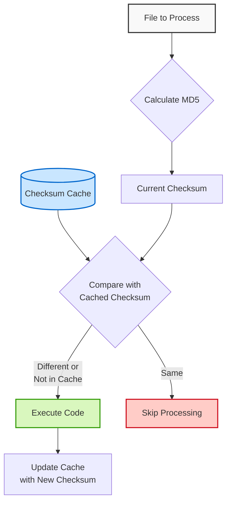

# PyChecksumCache

A lightweight Python library that uses MD5 checksums to track file changes and execute code only when files have been modified. PyChecksumCache maintains a persistent cache of file checksums, making it ideal for build systems, asset processors, incremental compilers, and any tools that need efficient change detection.

## How It Works



## Features

- Track changes to files using MD5 checksums
- Persistent cache storage in JSON format
- Execute functions only when file content has changed
- Monitor individual files or groups of files
- Batch transform multiple files with automatic output management
- Full async/await support for improved performance
- **Consistent handling of both absolute and relative paths**
- **Optional base directory for project-relative paths**
- Simple, intuitive API
- Works with Python 3.8+
- No external dependencies

## Installation

```bash
pip install pychecksumcache
```

Or with uv:

```bash
uv pip install pychecksumcache
```

## Quick Start

### Basic Usage

```python
from pychecksumcache import ChecksumCache

# Initialize with default cache file (.checksum_cache.json)
cache = ChecksumCache()

# Check if a file has changed since last check
if cache.has_changed("path/to/file.txt"):
    print("File has changed!")
    # Process the file...
    
# Execute a function only if the file has changed
def process_file(file_path):
    with open(file_path, 'r') as f:
        content = f.read()
    return f"Processed {len(content)} characters"

result = cache.execute_if_changed("path/to/file.txt", process_file, "path/to/file.txt")
if result:
    print(result)
else:
    print("File unchanged, processing skipped")
    
# Check if any file in a list has changed
files_to_check = ["file1.txt", "file2.py", "file3.json"]
if cache.any_changed(files_to_check):
    print("At least one file has changed!")
```

### Using with Project-Relative Paths

```python
from pychecksumcache import ChecksumCache
from pathlib import Path

# Set up a project directory structure
project_root = Path("/path/to/project")
cache_file = project_root / ".cache" / "checksums.json"

# Initialize with project-specific cache file and base directory
cache = ChecksumCache(
    cache_file=cache_file,
    base_dir=project_root  # All relative paths will be resolved against this
)

# Now you can use project-relative paths throughout your code
if cache.has_changed("src/main.py"):  # Will resolve to /path/to/project/src/main.py
    print("Main source file has changed!")

# Transform files using relative paths
input_files = ["src/templates/page1.html", "src/templates/page2.html"]
output_folder = "build/html"  # Will resolve to /path/to/project/build/html
cache.transform(input_files, output_folder, ".processed.html", process_template)
```

### Async Usage

```python
import asyncio
from pychecksumcache import ChecksumCache

# Define an async processing function
async def process_file_async(file_path):
    # Simulate some async IO operation
    with open(file_path, 'r') as f:
        content = f.read()
    await asyncio.sleep(0.1)  # Simulate async work
    return f"Processed {len(content)} characters asynchronously"

async def main():
    cache = ChecksumCache()
    
    # Check if a file has changed asynchronously
    has_changed = await cache.has_changed_async("path/to/file.txt")
    if has_changed:
        print("File has changed!")
    
    # Execute an async function only if file changed
    result = await cache.execute_if_changed_async(
        "path/to/file.txt", 
        process_file_async, 
        "path/to/file.txt"
    )
    
    if result:
        print(result)
    else:
        print("File unchanged, processing skipped")
    
    # Check if any files have changed asynchronously
    files = ["file1.txt", "file2.py", "file3.json"]
    if await cache.any_changed_async(files):
        print("At least one file has changed!")

# Run the async example
asyncio.run(main())
```

### Batch File Processing

The library provides a high-level API for batch transformations of multiple files:

```python
# Define input files and output settings
input_files = ['file1.txt', 'file2.txt']
output_folder = 'output'
output_extension = '.generated.txt'

# Define a transformation function
def transform_func(input_path, output_path):
    with open(input_path, 'r') as infile, open(output_path, 'w') as outfile:
        content = infile.read()
        # Apply some transformation
        transformed = content.upper()  # For example, convert to uppercase
        outfile.write(transformed)

# Perform the transformation - only changed files will be processed
results = cache.transform(input_files, output_folder, output_extension, transform_func)

# See which files were processed
for output_file, was_transformed in results:
    if was_transformed:
        print(f"Transformed: {output_file}")
    else:
        print(f"Skipped (unchanged): {output_file}")
```

### Async Batch Processing

Process multiple files concurrently for improved performance:

```python
import asyncio
from pychecksumcache import ChecksumCache

# Define an async transformation function
async def transform_func_async(input_path, output_path):
    # Read input file
    with open(input_path, 'r') as infile:
        content = infile.read()
    
    # Simulate async processing
    await asyncio.sleep(0.1)
    transformed = content.upper()
    
    # Write output file
    with open(output_path, 'w') as outfile:
        outfile.write(transformed)

async def main():
    cache = ChecksumCache()
    
    input_files = ['file1.txt', 'file2.txt', 'file3.txt', 'file4.txt']
    output_folder = 'output'
    
    # Process files concurrently (up to 5 at a time)
    results = await cache.transform_async(
        input_files,
        output_folder,
        '.processed.txt',
        transform_func_async,
        concurrency_limit=5
    )
    
    # Report results
    for output_file, was_transformed in results:
        if was_transformed:
            print(f"Transformed: {output_file}")
        else:
            print(f"Skipped (unchanged): {output_file}")

# Run the async batch processing
asyncio.run(main())
```

## Use Cases

- **Build Systems**: Rebuild only when source files change
- **Static Site Generators**: Regenerate pages only for modified content
- **Data Processing**: Process data files only when they've been updated
- **Asset Compilation**: Recompile assets only when source files change
- **Testing**: Run tests only for modified modules
- **Documentation Generation**: Update docs only for changed source files
- **Code Generation**: Generate code from templates only when inputs change
- **Parallel Processing**: Process multiple files concurrently with async support
- **Project Tools**: Work with project-relative paths for better portability

## API Reference

### ChecksumCache

```python
cache = ChecksumCache(
    cache_file=".checksum_cache.json",
    base_dir=None  # Defaults to current working directory
)
```

#### Basic Methods

- `calculate_md5(file_path)`: Calculate MD5 hash for a file
- `has_changed(file_path)`: Check if a file has changed since last check
- `execute_if_changed(file_path, function, *args, **kwargs)`: Execute function only if file changed
- `any_changed(file_list)`: Check if any file in the list has changed
- `all_changed(file_list)`: Check if all files in the list have changed
- `execute_if_any_changed(file_list, function, *args, **kwargs)`: Execute if any file changed

#### Async Methods

- `calculate_md5_async(file_path)`: Calculate MD5 hash asynchronously
- `has_changed_async(file_path)`: Check if a file has changed asynchronously
- `execute_if_changed_async(file_path, function, *args, **kwargs)`: Execute function async if file changed
- `any_changed_async(file_list)`: Check if any file changed asynchronously
- `all_changed_async(file_list)`: Check if all files changed asynchronously
- `execute_if_any_changed_async(file_list, function, *args, **kwargs)`: Execute async if any